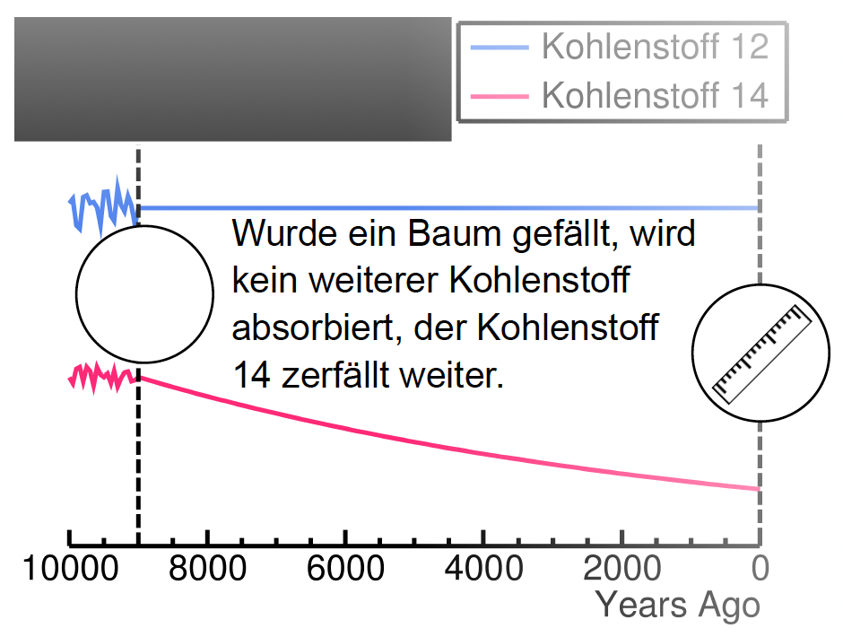

# Radiokarbondatierung (¹⁴C-Methode) ☢️

## Was ist Radiokarbondatierung?

Radiokarbondatierung nutzt das Verhältnis von **Kohlenstoff-14 zu Kohlenstoff-12**,
um das Alter eines Objektes zu bestimmen. Diese Technik ist besonders praktisch
bei **organischen Materialien**, welche bis zu **75.000 Jahre** alt sein können.

> 💡 Ähnliche Methoden, die jedoch andere Isotope verwenden,
> können für **anorganische** Materialien verwendet werden.

---

## Entstehung von ¹⁴C in der Atmosphäre

**Kosmische Strahlung** erzeugt energiereiche Neutronen in der oberen Atmosphäre.
Dabei wird ein Proton in **Stickstoff-14** ersetzt – und man erhält **Kohlenstoff-14**:

$$^{14}N + n \rightarrow {}^{14}C + p$$

---

## Das Prinzip: Lebende vs. tote Organismen 🌳

| Phase | Was passiert? |
|-------|--------------|
| **Lebender Organismus** | Solange z. B. ein Baum lebt, absorbiert er ¹²C und ¹⁴C in einem bestimmten Verhältnis aus der Luft. In jedem Jahresring steckt also ein charakteristisches Kohlenstoff-Verhältnis. |
| **Toter Organismus** | Wird ein Baum gefällt, wird kein weiterer Kohlenstoff absorbiert. Das ¹⁴C zerfällt weiter. |

*Abbildung: Während ¹²C (blau) stabil bleibt, nimmt ¹⁴C (pink) nach dem Tod
des Organismus exponentiell ab. Über das Verhältnis lässt sich das Alter bestimmen.*

---

## Die Kohlenstoff-Isotope im Überblick

| Isotop | Stabilität | Häufigkeit | Neutronen |
|--------|-----------|------------|-----------|
| **¹²C** | stabil | 98,9 % | 6 |
| **¹³C** | stabil | 1,1 % | 7 |
| **¹⁴C** | radioaktiv (t½ = 5.730 a) | 10⁻¹² % | 8 |

> **Isotope** sind Atome desselben Elements mit gleicher Protonenzahl,
> aber unterschiedlicher Neutronenzahl und damit unterschiedlicher Massenzahl.

---

## Isotope vs. Isobare

| Begriff | Definition |
|---------|-----------|
| **Isotope** | Selbes Element, selbe Protonenzahl, unterschiedliche Neutronenzahl → unterschiedliche Massenzahl |
| **Isobare** | Anderes Element, unterschiedliche Protonenzahl, **selbe** Massenzahl |

Ein wichtiges Isobar zu ¹⁴C ist **¹⁴N** (Stickstoff-14) – beide haben die Massenzahl 14,
bestehen aber aus unterschiedlich vielen Protonen und Neutronen.
Die Trennung solcher Isobare ist eine der großen Herausforderungen der AMS-Messung.

---

## Warum braucht man AMS?

Da ¹⁴C nur in verschwindend geringer Konzentration vorkommt (**10⁻¹² %**),
reicht konventionelle Massenspektrometrie nicht aus.
Das [CologneAMS](./) kann einzelne ¹⁴C-Atome von ihrem Isobar ¹⁴N und dem
viel häufigeren ¹²C trennen und so **präzise Alter** bestimmen.

---

[← Zurück zur Übersicht](radiokarbondatierung)
